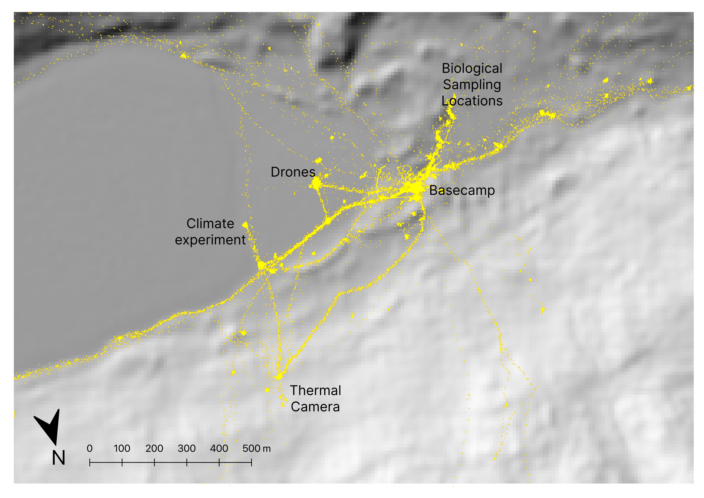

```{css, echo = FALSE}
/* This is to make things easier to read in the HTML */
p {color: black;}
figcaption {color: black;}
```

```{r}
#| output: false

library(ggplot2)
library(grid)
library(cols4all)
library(ggnewscale)
library(ggspatial)
library(patchwork)

library(tidyr)
library(dplyr)
library(purrr)
library(stringr)

library(igraph)

library(sf)
library(terra)
library(spatstat)
library(akima)

library(minpack.lm)

home <- "/Users/david/Documents/work/mwlr-tpm-antarctica/antarctica"
basename           <- "dry-valleys"
dem_resolution     <- "32m" # 10m also available, but probably not critical
resolution         <- 100   # 100 is high res for rapid iterating: use 200 while testing
impassable_geology <- "ice"

data_folder        <- str_glue("{home}/_data")
dem_folder         <- str_glue("{data_folder}/dem")

coastline          <- st_read(str_glue("{data_folder}/coastline.gpkg"))
basins             <- st_read(str_glue("{dem_folder}/antarctic-basins.gpkg"))
study_basins       <- st_read(str_glue("{dem_folder}/dry-valleys-and-skelton.gpkg"))
study_area         <- st_read(str_glue("{dem_folder}/study-area-extent.gpkg"))
gps_data           <- st_read(str_glue("{data_folder}/cleaned-gps-data/all-gps-traces.gpkg"))
tiles              <- st_read(str_glue("{dem_folder}/REMA-index-included-tiles.gpkg"))
shade              <- rast(str_glue("{dem_folder}/{dem_resolution}/dry-valleys-combined-{dem_resolution}-browse.tif"))
shade8             <- shade |>
  terra::aggregate(8) |>
  as.data.frame(xy = TRUE) |>
  rename(shade = `15_35_32m_v2.0_browse`)
geology            <- st_read(str_glue("{data_folder}/ata-scar-geomap-geology-v2022-08-clipped.gpkg"))
contiguous_geologies <- st_read(str_glue("{data_folder}/{basename}/common-inputs/contiguous-geologies.gpkg"))

base_folder        <- str_glue("{data_folder}/{basename}")
dem_file           <- str_glue("{dem_folder}/{dem_resolution}/{basename}-combined-{dem_resolution}-dem-clipped.tif")

source(str_glue("{home}/paper/raster-to-graph-functions-paper.R"))
```

### Abstract {.unnumbered}

We use GPS data collected on science expeditions in Antarctica to estimate hiking functions for the speed at which humans traverse terrain differentiated by slope and by ground cover (moraines and rock). 
We use the estimated hiking functions to build weighted directed graphs as a representation of specific environments in Antarctica. 
From these we estimate using a variety of graph metrics—particularly betweenness centrality—the relative potential for human environmental impacts arising from scientific activities in those environments. 
We also suggest a simple approach to planning science expeditions that might allow for reduced impacts in these environments.

## Introduction
Antarctica is often considered a vast, desolate continent devoid of human activity.
However, there are small, scientifically significant areas where substantial, regular human activity occurs.
Globally unique ice-free areas in Antarctica, such as the McMurdo Dry Valleys, are of particular scientific interest and a significant amount of activity occurs in this specially managed area.
Outside of a reduced period of activity caused by COVID-19, human activity on the continent continues to grow [@Tejedo2024] and so the actual, and future potential impact of these activities continues to grow. 
Human activity in Antarctica is dependent on the infrastructure that supports people to survive in this environment. 
The McMurdo Dry Valleys are close to the largest research base on the continent, McMurdo Station, and the pressures on this unique environment from human activity are increasing. 
Understanding the scope of human activity in key parts of Antarctica is critical to supporting environmental management of the continent.

The history of understanding the role and impacts of human activity in Antarctica begins with the Sixth Antarctic Treaty Consultative Meeting (ATCM) in 1970. 
A recommendation of the final report of this meeting was for member countries to encourage research on how human activity impacts Antarctica and its ecosystems [@ATCM1970 Recommendation VI-4].
By the mid-1980s, it was recognised that scientific activity, particularly the logistics required to support that activity, required additional scrutiny, and also that scientific activity could pose a greater threat to Antarctica’s ecosystems than tourism [@Benninghoff1985]. 
At this point, the need for more understanding and the ability to forecast the environmental impact of human activity was recognised [@ATCM1985 Paragraph 46]. 

Moving into the mid-1990s, the multi-disciplinary scope of large programmes of research such as the McMurdo Dry Valleys Long Term Ecological Research programme, increased the number of researchers in the field while also supporting more research into the history of human activity in the Dry Valleys [@Priscu2016].
With the establishment of the Committee for Environmental Protection (CEP) in 1998, human activities (including science activities) were to be monitored, but attention moved away from the understanding and scope of the activities, and became more focused on potential resulting impacts of those activities. 
For example, the current 5-year Work Plan for the CEP (REF), has several items associated with human activities but these are focused on managing the impact of human activities rather than quantifying the current level of activity, or forecasting cumulative impacts of the activity. 

More recent research has focused either on a continental-scale picture of human activity [@Leihy2020], or detailed mapping of the infrastructural footprint and impacts that the numerous Antarctic stations have on the continent [@Brooks2018; @Brooks2019].
These approaches tackle the challenge of understanding human activity from contrasting spatial perspectives. 
The present research aims to complement these efforts, by using high resolution mapping of human activity in the dry valleys to extrapolate how scientists navigate in these landscapes, or could potentially navigate in these landscapes.

In the next section we outline our approach and discuss related work. 
We then describe data sources, both general environmental and topographic, and the detailed GPS data from which our findings are derived. 
Procedures for deriving hiking functions and applying them to build hiking networks as representations of the dry valleys landscapes are explained, followed by examples of analyses possible using this approach, particularly the application of measures of graph betweenness centrality as proxies for potential impact. 
We also outline how these methods might be used to plan for reduced impact from scientific expeditions to these environments. 
The paper concludes with a discussion of our findings, prospects for further work, and some general conclusions.

## Our approach and related work
We chose to explore the question of where human impacts are likely to be strongest using an approach closely related to work on patterns of human movement in archaeology [@Verhagen2019] where likely and potential movement paths of humans across landscapes have been used to infer the settlement structure and human geography of large-scale landscapes. 
Closely related work in biology investigates the structure and geography of animal transportation networks [@Perna2014]. 
Both approaches rely on the idea that humans or animals move around in an environment in time or energy efficient ways. 
These approaches rely on hiking functions that relate speed of movement across a terrain to its slope.

Hiking functions must be applied in some context where locations across a landscape are connected to one another. 
Because hiking functions are asymmetric, with estimated speed of movement up slopes different than estimated speeds down the same slope, landscape must be represented in a way that allows for this asymmetry. 
We therefore represent terrain in our landscapes as directed graphs (i.e., networks) of connections between locations regularly distributed in planimetric space across the landscape of interest. 
Because the graphs are directed the costs associated with movement between two locations can be different depending on the direction of movement. 
Additionally, we associate with locations (i.e., vertices in the graph) the ground cover at the location, which also affects the speed at which it can be traversed. 
Because the ground cover in the Antarctic environments under study can be broadly categorised into only two types, moraine and rock, we use the ground cover of a location to switch between two estimated hiking functions, rather than the more widely used approach of penalising movement on different ground covers by applying cost factors. 
We consider previous work on hiking functions and directed graphs in more detail below.

### Hiking functions {#sec-hiking-functions}
@Prisner2023 provide an overview of a variety of functions that have been used to model how hiking times and speeds vary with terrain slope. 
They consider longstanding rules of thumb [@Naismith1892], and later modifications thereof [@Langmuir1984], along with more recent such guidance from the Swiss and German Alpine Clubs [@Winkler2010; @DeutscherundOstereichischerAlpenverein2011]. 
These functions estimate the time taken to travel 1km, referred to as *pace*, based on slope, expressed as *rise over run*, that is change in elevation divided by horizontal distance. 
These are all piecewise functions with sharp changes in estimated pace at specific slopes.

Alongside hiking pace functions @Prisner2023 also present hiking speed functions (usually referred to as simply *hiking functions*) from @Tobler1993 [generally considered the first hiking function] and more recent, more empirically grounded alternatives offered by @Marquez-Perez2017, @Irmischer2018, and @Campbell2019a. 
Another hiking function not discussed by @Prisner2023 is presented by @Rees2004. 
These functions are all continuous in the slope of the terrain so that $v=f(\theta)$, where $v$ is the speed, and $\theta$ is the slope. 
They can all be parameterised to control the maximum speed attainable, the slope at which maximum speed is attained (expected to be a shallow downhill slope), and the rate at which speed falls off with increasing slope.

The functional forms of some hiking functions are shown in @tbl-hiking-function-equations and graphed in @fig-hiking-functions.

| Description | Equation                                 | Examples                        |
|:-           |:-                                        |:-----                           |
| Exponential | $ae^{b\left|\theta-c\right|}$            | @Tobler1993, @Marquez-Perez2017 |
| Gaussian    | $ae^{-b(\theta-c)^2}$                    | @Irmischer2018, @Campbell2019a   |
| Lorentz     | $\frac{a}{\left[b+d(\theta-c)^2\right]}$ | @Campbell2019a                   |
| Quadratic   | $a+b\theta+c\theta^2$                    | @Rees2004                       |

: Alternative functional forms of hiking functions {#tbl-hiking-function-equations .striped}

```{r}
#| label: fig-hiking-functions
#| fig-cap: "Example hiking functional forms: Exponential [@Tobler1993], Gaussian [@Irmischer2018], Lorentz [@Campbell2019a], and Quadratic [@Rees2004]."

theme_set(theme_minimal())
theme_update(
  panel.border = element_rect(linewidth = 0.5, fill = NA))

tobler <- function(theta, a = 6, b = 3.5, c = -0.05) {
  a * exp(-b * abs(theta - c))
}
gaussian <- function(theta, a = 5.5, b = 0.25, c = -0.04) {
  a * exp(-(theta - c) ^ 2 / 2 / b ^ 2)
}
lorentz <- function(theta, a = 4.75, b = 0.9, c = -0.06, d = b / pi) {
  a / (b * (1 + ((theta - c) / d) ^ 2))
}
rees <- function(theta, a = 5.25, b = -1.5, c = -16.5) {
  5 + b * theta + c * theta ^ 2
}

results <- tibble(Slope = -50:50/100,
                  Exponential = tobler(Slope), 
                  Gaussian = gaussian(Slope),
                  Lorentz = lorentz(Slope),
                  Quadratic = rees(Slope)) |>
  pivot_longer(cols = -1) |>
  rename(`Functional form` = name, `Speed, km/h` = value)

ggplot(results) +
  geom_line(aes(x = Slope, y = `Speed, km/h`, linetype = `Functional form`,
            colour = `Functional form`, group = `Functional form`), linewidth = 1) +
  scale_colour_discrete_c4a_cat("brewer.set1") +
  scale_linetype_manual(values = c("solid", "longdash", "dotdash", "dotted")) + 
  scale_x_continuous(limits = c(-0.5, 0.5), expand = c(0, 0)) +
  scale_y_continuous(limits = c(0, 6.25), expand = c(0, 0)) +
  geom_vline(aes(xintercept = -0.05), lwd = 0.35, linetype = "dotted") +
  annotate("label", x = -0.055, y = 0.3, label = "Peak speed slope (exponential)", 
           angle = 90, hjust = 0, vjust = 0.6, label.size = 0)
```

The parameterisations of the functions in @fig-hiking-functions have been chosen for illustrative purposes only, although the parameter values for the exponential function shown are such that $v=6e^{-3.5\left|\theta+0.05\right|}$ as suggested in @Tobler1993. 
These parameters give *Tobler's hiking function* but, as has been noted elsewhere [see @Herzog2010;@Campbell2019a], are based on a poorly specified fit to secondary data on hiking speeds found in @Imhof1950 [pp. 217-220].
Nevertheless, these parameter values are widely applied in the literature.

All these hiking functional forms are somewhat *ad hoc*. 
They exhibit desirable, expected properties: a peak speed at a slope near zero, which we expect to be slightly negative (i.e., downhill), and continuously falling speeds as the slope deviates from the slope of peak speed. 
However, there is no theoretical basis for the specific functional forms listed in @tbl-hiking-function-equations. 
More principled approaches might be developed based on literature on the physiology of human movement [see, e.g., @Minetti2002]. 
In general, approaches based on minimising energy use yield similar results to empirical speed-slope functions, although it is worth noting that they more reliably generate zig-zag or 'switchback' movement behaviour on steep slopes [@Llobera2007]. 
However, these are challenging to implement, and we have adopted empirically-derived and locally-specific hiking functions following @Marquez-Perez2017, @Irmischer2018, and @Campbell2019a. 
This choice is based on available data and the goals of our study, where the relative cost of different potential routes in the landscape is more important than exact prediction of routes. 
In practice, almost any function with the peaked form of those shown in @fig-hiking-functions is suited to our requirements.

It is commonplace in many applications to also incorporate a penalty on movement contingent on land cover, especially for off-track or off-road movement. 
For example the speed attainable off-track in forested terrain might be only half that attainable in grasslands. 
Unsurprisingly, there are no widely agreed land cover penalties, but see for example, those compiled by @Herzog2020. 
A hiking function derived by @Wood2023 includes the local gradient of the terrain (i.e., the maximum slope at each location, not the slope in the direction of movement) as a covariate in the estimated function. 
It is possible that this kind of approach including other spatial covariates, such as land cover (which would be a categorical variable in most cases) in the estimation of complex hiking functions might be more widely applied in future work. 
In our application, because there are only two kinds of navigable land cover&mdash;moraine (or gravel) and rock&mdash;we chose instead to estimate two hiking functions, one for each land cover, and estimate movement costs conditional on the land cover at each location. 
This also has the advantage of allowing for differing effects of slope on speed due to land cover, where for example, gravel might allow more rapid movement on the level surfaces, but more rapidly reduce speed on slopes. 
Details of this approach are reported and discussed in @sec-hiking-function-estimation.

### Representing the landscape
A has been noted, hiking functions are usually asymmetric, with the highest attainable speed at a slight downhill slope. 
This asymmetry means that unless analysis is focused on assessing movement cost from a single origin or to a single destination, it is necessary to represent the landscape in a way that can accommodate asymmetry. 
We therefore represent the landscape as a directed graph $G(V,E)$ of vertices and directed edges connecting them.
In this representation, graph vertices $v_i$ are locations with associated elevation and land cover. 
Vertices minimally have spatial coordinates $(x_i,y_i)$, an elevation $z_i$, and a land cover, $C_i$:

$$
v_i=\left(x_i,y_i,z_i,C_i\right)
$$ {#eq-vertex}

Graph edges $e_{ij}=\left(v_i,v_j\right)$ are directed connections between vertices for which a change in elevation between the start and end vertex can be calculated, and a slope derived, based on the elevation difference, and the horizontal distance between the vertices.
Thus the slope $\theta_{ij}$ of edge $e_ij$ is given by 

$$
\theta_{ij}=\frac{z_j-z_i}{\sqrt{(x_i-x_j)^2+(y_i-y_j)^2}}
$$ {#eq-slope-of-edge}

The obvious way to derive such a graph from spatial data is to assign each cell in a raster digital elevation model (DEM) to a graph vertex, so that vertices are arranged in a regular square grid or lattice.
However, this still requires a decision about how to define graph edges, which can be thought of in terms of _allowed moves_ between vertices. 
Three possibilities on a square lattice&mdash;Rook's, Queen's, and Knight's moves&mdash;are shown in @fig-lattice-adjacencies [see @Pingel2010].
Another option shown in the figure is to lay out a regular hexagonal grid of vertex locations and link each vertex to its six nearest neighbours.

```{r}
#| label: fig-lattice-adjacencies
#| fig-cap: Possible graph lattices.
#| fig-width: 4
#| fig-height: 4.2

theme_set(theme_void()) 
theme_update(
  plot.margin = unit(c(1, 1, 2, 1), "mm"),
  plot.title = element_text(hjust = 0.5, vjust = 2))

get_lattice <- function(dist, pts) {
  pts |>
    st_buffer(dist) |>
    st_contains(pts, sparse = FALSE) |>
    as.matrix() |>
    graph_from_adjacency_matrix(mode = "directed", diag = FALSE) |>
    set_vertex_attr("x", value = pts$x) |>
    set_vertex_attr("y", value = pts$y)
}

get_graph_plot <- function(G, main, crs = 2193) {
  return(ggplot() +
    geom_sf(data = G |> 
              get_graph_as_line_layer(crs = 2193), lwd = 0.4,
              colour = "black") +
    geom_sf(data = G |> vertex_attr() |> as.data.frame() |> 
            st_as_sf(coords = 1:2, crs = crs), size = 8, fill = "lightgrey", 
            colour = "white", shape = 21, lwd = 1) +
    coord_sf(xlim = c(-270, 270) + 1e6, 
             ylim = c(-270, 270) + 1e6, expand = FALSE) +
    ggtitle(main) +
    theme(title = element_text(size = 6)))
}

grid_pts <- expand_grid(x = -20:20 * 100 + 1e6, y = -20:20 * 100 + 1e6) |>
  as.data.frame() |>
  st_as_sf(coords = c("x", "y"), crs = 2193, remove = FALSE)

hex_grid_pts <- grid_pts |>
  st_bbox() |> 
  st_make_grid(square = FALSE, what = "centers", cellsize = 107.457) |>
  st_as_sf() |>
  rename(geometry = x) |>
  mutate(geometry = geometry + c(-12, -3)) |>
  st_set_crs(2193)

xy <- hex_grid_pts |> st_coordinates()
hex_grid_pts <- hex_grid_pts |>
  mutate(x = xy[, 1], y = xy[, 2])

graphs <- mapply(
  get_lattice,
  list(101, 150, 225, 110),
  list(grid_pts, grid_pts, grid_pts, hex_grid_pts))
names(graphs) <- list("Rook's move", "Queen's move", "Knight's move", "Hexagonal")

ggplots <- list()
for (n in names(graphs)) {
  ggplots[[n]] <- get_graph_plot(G = graphs[[n]], main = n)
}

wrap_plots(ggplots, nrow = 2)
```

The advantage of a square lattice is that it is easy to derive vertex elevations assuming a DEM at the desired lattice spacing is available. 
A hexagonal lattice on the other hand usually requires that elevation values be interpolated from a DEM to the lattice locations.

Both square and hexagonal lattices lead to geometric artifacts when the allowed moves are used to determine contours of equal travel time or *isochrones* from an origin point on a flat surface with uniform movement speeds. 
In this situation, the Rook's move produces diamond-shaped isochrones, while the Queen's move produces octagons.
In general isochrones will be polygons with as many sides as the number of neighbours of each vertex. 
While the 16-gons of the Knight's move lattice are likely to be close enough to circular for many purposes, the resulting graph is denser than the alternatives. 
@Etherington2012 suggests that by combining results from randomly generated planar graphs such geometric artifacts can be removed, but this substantially increases the computational requirements. 
Another computationally intensive approach might draw on methods for estimating geodesics on complex triangular meshes [@Martinez2005].
Because the geometric effects of graph structure are masked when we introduce varying movement speeds due to the slope of each edge, we do not consider these more complex approaches necessary in our application. 
Nevertheless, more circular base isochrone shapes are to be preferred, all other things equal.

A further complication when a lattice includes edges of varying length as in the Queen's and Knight's move lattices, is bias in the estimation of slopes leading to lower estimated movement costs for longer edges. 
This is because longer edges (e.g., the knight's moves) may 'jump' across intervening segments of varying slope, smoothing them to a single slope estimate.
Such smoothing will usually result in shorter edge traversal times along such edges than those that would accumulate along intervening sections of varying slope. 
This problem is discussed in a slightly different context by Campbell et al. [-@Campbell2019a pp. 96-98].

Any choice of graph structure is necessarily a compromise, and estimates of movement rates are always an approximation [@Goodchild2020]. 
We consider the differing edge lengths introduced by all the square lattices other than the Rook's case to be problematic, and favour the hexagonal lattice structure over the simple square lattice because a base hexagonal isochrone is preferable to a diamond shape.

Having settled on a hexagonal lattice for the graph structure, at a chosen resolution we set out a regular hexagonal grid of locations across the study area, and assign to each point an elevation by interpolation from a DEM. 
Because the DEM is at finer resolution than the hexagonal lattice, the choice of interpolation method is not a major concern.
Our approach applies bilinear interpolation based on elevation values in the DEM cell the graph vertex falls in and its four orthogonal neighbours.
Based on the difference in elevation of the vertices at each end of each edge we estimate a slope using @eq-slope-of-edge, and also traversal times using our estimated hiking function. 
The important point here is that our graph is _directed_ so that different traversal times $t_{ij}$ and $t_{ji}$ are estimated for moving between vertex $v_i$ and $v_j$ depending on the direction of travel.

As noted in the previous section, we estimate two hiking functions, one for moraine and one for rock land cover. 
When an edge connects locations of two different land cover types the estimated traversal time is the mean of the traversal times for each land cover. 

## Data sources
### Antarctic geospatial data
Geospatial data for Antarctica were obtained from sources referenced in @Cox2023, @Cox2023a, and @Felden2023.
The study area was defined to be the Skelton and Dry Valleys basins, as defined by the NASA Making Earth System Data Records for Use in Research Environments (MEaSUREs) project [@Mouginot2017] and shown in @fig-study-area&#8202;(a).
The Skelton basin was included because while the expedition GPS data was ostensibly collected in the McMurdo Dry Valleys, it actually extends into that basin as shown in @fig-study-area&#8202;(b).
Elevation data from the Reference Elevation Model of Antarctica (REMA) project [@Howat2022], and geology from GeoMAP [@Cox2023] are shown in @fig-study-area&#8202;(c).
The five largest areas of contiguous non-ice surface geology across the study area shown in @fig-study-area&#8202;(d) were chosen to be the specific sites for more detailed exploration using the methods set out in this paper.
These range in size from around 320 to 2600 square kilometres.

```{r}
#| echo: false

theme_set(theme_minimal())
bb1 <- st_bbox(study_area)
g31 <- ggplot() +
  geom_sf(data = coastline, fill = "#eff3ff", colour = "#3182bd") +
  geom_sf(data = study_area, fill = "#666666", colour = NA, lwd = 0) +
  annotate("rect", xmin = bb1[1], ymin = bb1[2], 
                   xmax = bb1[3], ymax = bb1[4], fill = "#00000000", colour = "red") +
  theme(panel.border = element_rect(fill = NA, colour = "black", linewidth = 0.5),
        panel.grid = element_line(colour = "black", linewidth = 0.05),
        panel.ontop = TRUE)

theme_set(theme_void())
g32 <- ggplot() +
  geom_sf(data = coastline, fill = "#eff3ff", colour = "#00000000") +
  geom_sf(data = study_basins, fill = "gray", colour = "white") +
  geom_sf(data = coastline, fill = "#00000000", colour = "#3182bd") +
  geom_sf(data = gps_data, colour = "red", size = 0.025) +
  geom_sf_text(data = study_basins, aes(label = NAME), size = 3) +
  coord_sf(xlim = bb1[c(1, 3)], ylim = bb1[c(2, 4)]) +
  annotation_scale(height = unit(0.1, "cm"), location = "tr") +
  annotation_north_arrow(
    which_north = "true", style = north_arrow_minimal,
    height = unit(0.8, "cm"), width = unit(0.4, "cm"), location = "bl") +
  theme(panel.border = element_rect(fill = NA, colour = "black", linewidth = 0.5))

top5 <- contiguous_geologies |> 
  arrange(desc(area)) |> 
  slice(1:5)
bb2 <- st_bbox(top5)
g33 <- ggplot() +
  geom_sf(data = coastline, fill = "#eff3ff", colour = "#3182bd") +
  geom_sf(data = study_area, fill = "#00000000", colour = "darkblue") +
  geom_sf(data = geology, aes(fill = POLYGTYPE), linewidth = 0, colour = NA) +
  scale_fill_manual(values = c("dodgerblue", "#fec44f", "#993404"), name = "Geology") + 
  new_scale("fill") +
  geom_raster(data = shade8, aes(x = x, y = y, fill = shade), alpha = 0.5) +
  scale_fill_distiller(palette = "Blues", guide = "none") +
  annotate("rect", xmin = bb2[1], ymin = bb2[2], 
                   xmax = bb2[3], ymax = bb2[4], fill = "#00000000", 
                   colour = "red", lwd = 0.25, linetype = "dashed") +
  coord_sf(xlim = bb1[c(1, 3)], ylim = bb1[c(2, 4)]) +
  theme(panel.border = element_rect(fill = NA, colour = "black", linewidth = 0.5))

small_geologies <- contiguous_geologies |> 
  filter(area < min(top5$area))
g34 <- ggplot() +
  geom_sf(data = coastline, fill = "#eff3ff", colour = "#3182bd") +
  geom_sf(data = geology, aes(fill = POLYGTYPE), linewidth = 0, colour = NA) +
  scale_fill_manual(values = c("dodgerblue", "#fec44f", "#993404"), name = "Geology") + 
  geom_sf(data = small_geologies, fill = "#ffffffc0", colour = "darkgrey") +
  # geom_sf(data = top5, fill = NA, colour = "black", linewidth = 0.2) +
  guides(fill = "none") +
  annotation_scale(height = unit(0.1, "cm")) +
  coord_sf(xlim = bb2[c(1, 3)], ylim = bb2[c(2, 4)]) +
  theme(panel.border = element_rect(fill = NA, colour = "black", linewidth = 0.5))
```

```{r}
#| label: fig-study-area
#| fig-cap: "The study area: (a) Study area location in Antarctica; (b) Skelton and Dry Valleys basins; (c) Study area elevation (hillshade) and surface geology; and (d) Five sub-regions of contiguous surface geology."

(g31 + g32) / (g33 + g34 + plot_layout(guides = "collect")) + 
  plot_annotation(tag_levels = "a", tag_prefix = "(", tag_suffix = ")",
                  theme = theme(plot.title = element_text(size = 9)))
```

### GPS data from expeditions
GPS data recording how scientists moved around the McMurdo Dry Valleys was collected using QStarz Q1100P GPS Tracking Recorders between 2016 and 2018 (see @fig-gps-device).
These units were selected for their long battery life (40+ hours), chipset sensitivity, and simple design and use.

{#fig-gps-device fig-width="60.88mm"}

Each unit was set to record a location every 30 seconds. 
Scientists turned on the devices when leaving base camp in the morning and turned them off when returning at the end of the day.
The units were attached to the top of a backpack to ensure units had good access to the GPS signal. 

Participants were sourced through existing networks of scientists supported by the New Zealand Antarctic Programme who were going to Antarctica for research purposes. 
All participants were asked if they wished to carry a GPS recorder. 
The study was entirely voluntary. 
Over the duration of the two primary field events, 40 people used the devices, yielding over 200 person days of activity data. 
Social Ethics approval was granted by the Manaaki Whenua Landcare Research Social Ethics committee (SE 1617/05).

Sample output of the GPS data is shown in in @fig-sample-gps-data.

{#fig-sample-gps-data fig-width="100mm"}

It was necessary to process the GPS data to prepare it for use in the estimation of hiking functions. 
The first processing step was to confirm the plausibility of the data, particularly the device-generated speeds, distances between fixes, and elevations associated with fixes.
The challenges of post-processing GPS data are well documented [see e.g., @Ranacher2016] and relate to issues with GPS drift which can lead to estimated non-zero movement speeds as a result of noise in the signal.
The raw GPS data included distance since last fix, speed, and elevation estimates and it was determined by inspection that in all cases that the device generated results for these measurements were likely to be more reliable than post-processing the raw latitude-longitude fixes to estimate these quantities.

The second processing step was to remove fixes associated with faster movement on other modes of transport than walking.
@Wood2023 cite a number of previous works that base detection of trip segments based on recorded speeds.
This method was trivially applicable to our data to a limited degree as scientists arrive at the expedition base camp and occasionally also travel on helicopters on trips to more remote experimental sites. 

The third, more challenging processing step was to deal with sequences of fixes associated with non-purposeful movement when scientists were in or around base camp, at rest stops, or at experimental sites. 
Crude filters removed fixes with low recorded distances between fixes (less than 2.5 metres), high turn angles at the fix location (greater than 150&deg;), and fixes recorded on ice-covered terrain, but this did not clean the data sufficiently for further analysis.
An additional filtering step was to count fixes (across all scientists) in hexagonal cells (the same cells used in construction of the landscape network) and remove all fixes in grid cells with more than 50 fixes.
This removed heavily trafficked areas around base camp and experimental sites where much of the recorded movement was not indicative of achievable speeds when moving purposefully across the landscape.

This left one persistent concern: an over-representation of consecutive fixes recorded at exactly the same elevation, resulting in many fixes with estimated slopes of exactly 0, and leading to a clearly evident dip in estimated movement speeds at 0 slope (@fig-gps-data&#8202;(a)). 
It is likely that these fixes are associated with GPS device drift, so a it was decided to remove all fixes where estimated slope was exactly 0.
@fig-gps-data&#8202;(b) shows the improvement in even a crudely estimated hiking function derived from local scatterplot (LOESS) smoothing.
Note that such functions are likely overfitted and not used further in our analysis where we favour more easily parameterised functions such as those discussed in @sec-hiking-functions.

```{r}
#| output: false
# gps data and its bbox
bb <- gps_data |> st_bbox() # this is to allow plotting restricted to GPS extents

# geologies data
geologies <- geology |> 
  dplyr::select(POLYGTYPE) |>
  st_filter(bb |> st_as_sfc()) |> 
  mutate(cover = factor(str_to_title(POLYGTYPE)))

# join geologies to the gps data
gps_geol <- gps_data |>
  st_join(geologies) |>
  dplyr::select(-POLYGTYPE) |> 
  # we do not further consider 'ice' terrain, or
  # observations at negative elevations
  filter(cover != "ice", height_m > 0) |>
  mutate(slope_h_round = round(slope_h * 10) / 10) |>
  drop_na()

g41 <- ggplot(gps_geol |> filter(slope_h >= -1, slope_h <= 1.0)) +
  geom_boxplot(aes(x = round(slope_h, 1), y = speed_km_h, group = round(slope_h, 1)), 
               outlier.size = 0.2, colour = "grey", linewidth = 0.5) +
  stat_smooth(aes(x = slope_h, y = speed_km_h)) +
  xlab("Slope, rise over run") + ylab("Speed, km/h") +
  theme_minimal()
```

```{r}
#| output: false
hexes <- gps_geol |> 
  st_make_grid(cellsize = 100, square = FALSE, what = "polygons") |>
  st_as_sf(crs = st_crs(gps_geol)) |>
  rename(geom = x) |>
  st_join(gps_geol |> mutate(id = row_number()), left = FALSE) |>
  group_by(geom) |>
  summarise(n = n(), n_persons = n_distinct(name)) |>
  ungroup()

gps_geol_purposive <- gps_geol |> 
  # see above
  filter(slope_h != 0) |>
  # these two remove 'dithering'
  filter(turn_angle < 150) |>
  filter(distance_m > 2.5) |>
  # remove fixes in densely trafficked areas
  st_join(hexes) |>
    filter(n <= 50)

g42 <- ggplot(gps_geol_purposive) +
  geom_boxplot(aes(x = round(slope_h, 1), y = speed_km_h, group = round(slope_h, 1)), 
               outlier.size = 0.2, colour = "grey", linewidth = 0.5) +
  stat_smooth(aes(x = slope_h, y = speed_km_h)) +
  xlab("Slope, rise over run") + ylab("Speed, km/h") +
  theme_minimal()
```

```{r}
#| label: fig-gps-data
#| fig-cap: "GPS data and crudely estimated hiking functions before and after filtering to remove fixes associated with non-purposive movement: (a) Boxplots by slope of speed, with smoothed estimated hiking function showing a 'dip' due to over-representation of 0 slope fixes; and (b) After filtering the estimated hiking function no longer has a dip."
#| fig-width: 6
#| fig-height: 4
g41 + g42 + 
  plot_annotation(tag_levels = "a", tag_prefix = "(", tag_suffix = ")",
                  theme = theme(plot.title = element_text(size = 16)))
```

## Methods and results
### Hiking functions {#sec-hiking-function-estimation}
We fit three alternative functional forms to the cleaned GPS data: exponential [@Tobler1993], Gaussian [following @Irmischer2018], and Lorentz [following @Campbell2019a] using the Levenburg-Marquardt algorithm [@More1978] as provided by the `nlsLM` function in the `minpack.lm` R package [@Elzhov2022].
The raw data and fitted curves are shown in @fig-comparison-of-hiking-functions.

```{r}
get_gaussian_hiking_function <- function(df) {
  nlsLM(speed_km_h ~ a * dnorm(slope_h, m, s), data = df,
        start = c(a = 5, m = 0, s = 0.5))
}
get_tobler_hiking_function <- function(df) {
  nlsLM(speed_km_h ~ a * exp(-b * abs(slope_h + c)), data = df,
        start = c(a = 5, b = 3, c = 0.05))  
}
get_lorentz_hiking_function <- function(df) {
  nlsLM(speed_km_h ~ a /(pi * b * (1 + ((slope_h - c) / b) ^ 2)), 
        data = df, start = c(a = 5, b = 1, c = -0.05))
}

# makes a prediction data frame with x, y values
# slopes is a DF with one column called slope_h
get_model_prediction_df <- function(m, slopes) {
  data.frame(x = slopes, y = predict(m, data.frame(slope_h = slopes$slope_h)))
}

slopes <- data.frame(slope_h = -150:150 / 100)

hiking_functions <- list(
  Exponential = get_tobler_hiking_function,
  Gaussian = get_gaussian_hiking_function,
  Lorentz = get_lorentz_hiking_function
)
covers <- c("Moraine", "Rock")

models <- list()
predictions <- list()
inputs <- list()
i <- 1
for (name in names(hiking_functions)) {
  for (cover_type in covers) {
    df <- gps_geol_purposive |> 
      filter(cover == cover_type) 
    m <- hiking_functions[[name]](df)
    models[[cover_type]][[name]] <- m
    predictions[[i]] <- get_model_prediction_df(m, slopes) |>
      mutate(cover = cover_type, Model = name)
    inputs[[i]] <- df |>
      mutate(cover = cover_type, Model = name)
    i <- i + 1
  }
}
model_predictions <- bind_rows(predictions)
input_data <- bind_rows(inputs)
```

```{r}
#| label: fig-comparison-of-hiking-functions
#| fig-cap: Three possible hiking functions applied to GPS data split by land cover.
#| fig-width: 6
#| fig-height: 4
ggplot() +
  geom_boxplot(data = gps_geol_purposive |> filter(cover != "Ice"),
               aes(x = slope_h_round, y = speed_km_h, group = slope_h_round),
               outlier.size = 0.35, colour = "grey", linewidth = 0.5) +
  # geom_point(data = input_data, aes(x = slope_h, y = speed_km_h)) + 
  geom_line(data = model_predictions, aes(x = slope_h, y = y, colour = Model)) +
  xlab("Slope, rise over run") + ylab("Speed, km/h") +
  facet_wrap( ~ cover, ncol = 3) +
  theme_minimal()
```

The Lorentz function offers a marginal improvement in the model fit in comparison with the Gaussian function, while both are clearly better than the exponential form. 
However, the improvement offered by the Lorentz function over the Gaussian is marginal: residual standard error 1.489 vs 1.491 on Moraine, and 1.487 vs 1.488 on Rock, and inspection of the curves shows that estimated hiking speeds for the Gaussian functions are much closer to a plausible zero on very steep slopes. 
We therefore chose to adopt Gaussian hiking functions for the remainder of the present work.

In previous work researchers have applied a ground cover penalty cost to a base hiking function to estimate traversal times.
We instead, as shown, estimate different hiking functions for the two ground cover types present.
The peak speed on rock is attained on steeper downhill slopes than on moraines, perhaps indicative of the greater care required on downhill gravel slopes. 
Meanwhile the highest speeds on level terrain are attained on moraines.

```{r}
# make a all data function
df <- gps_geol_purposive 
m3 <- get_gaussian_hiking_function(df)
models[["All"]][["Gaussian"]] <- m
model_predictions <- model_predictions |>
  bind_rows(get_model_prediction_df(m, slopes) |> 
              mutate(cover = "All", model = "Gaussian"))
input_data <- input_data |>
  bind_rows(df |> mutate(cover = "All", model = "Gaussian"))

```

```{r}
#| output: false

conf <- 0.95
pred1 <- predictNLS(models[["Moraine"]][["Gaussian"]], newdata = slopes, level = conf) |>
  as.data.frame() |>
  mutate(x = slopes$slope_h, cover = "Moraine")
pred2 <- predictNLS(models[["Rock"]][["Gaussian"]], newdata = slopes, level = conf) |>
  as.data.frame() |>
  mutate(x = slopes$slope_h, cover = "Rock")
pred3 <- predictNLS(m3, newdata = slopes, level = conf) |>
  as.data.frame() |>
  mutate(x = slopes$slope_h, cover = "All")
predictions <- bind_rows(pred1, pred2, pred3)
```

Plotting both hiking functions along with an additional model fitted to all the data on the same axes confirms that the fitted functions are sufficiently different to retain separate models for each ground cover (see @fig-models-by-cover-compared).
Plotting both functions in the same graph makes clearer the difference in maximum speed and slope at maximum speed associated with each ground cover.

```{r}
#| label: fig-models-by-cover-compared
#| fig-cap: The hiking functions for All, Moraine and Rock ground covers compared, including 95% confidence intervals derived by Monte-Carlo simulation.
#| fig-width: 6
#| fig-height: 4
ggplot() +
  geom_ribbon(data = predictions |> filter(cover == "All"), 
              aes(x = x, ymin = `2.5%`, ymax = `97.5%`), 
              colour = "black", lty = "dashed", fill = "#00000000", linewidth = 0.35) +
  # geom_line(data = predictions |> filter(cover == "All"), aes(x = x, y = mean, colour = cover)) +
  scale_colour_manual(name = "", breaks = c("All"), values = c("black")) +
  geom_ribbon(data = predictions, 
              aes(x = x, ymin = `2.5%`, ymax = `97.5%`, group = cover, fill = cover), 
              alpha = 0.35, linewidth = 0) + 
  scale_fill_manual(values = c("black", "firebrick", "dodgerblue"), name = "Cover") +
  xlab("Slope, rise over run") + ylab("Speed, km/h") +
  theme_minimal()
```

The estimated hiking functions associated with the two land covers are
$$
\begin{array}{rcl}
v_{\mathrm{moraine}} & = & 4.17\,\exp\left[{-\frac{(\theta+0.0526)^2}{0.236}}\right] \\
v_{\mathrm{rock}}    & = & 3.76\,\exp\left[{-\frac{(\theta+0.119)^2}{0.365}}\right]
\end{array}
$$ {#eq-estimated-hiking-functions}

where the difference between moraine and rocky terrain in terms of maximum speeds 4.17 vs 3.76 km/hr, and slopes of maximum speed -0.0526 vs -0.119, are apparent.

### Landscapes as graphs
We developed R code [@RCoreTeam2025] to build graphs (i.e. networks) with hexagonal lattice structure and estimated traversal times for graph edges derived from our hiking functions. 
Graphs are manipulated as `igraph` package [@Csardi2006a; @Csardi2024] graph objects for further analysis.
An important decision in constructing graphs is choice of the spacing of the hexagonal lattice, and also of the underlying DEM from which graph vertex elevations are derived.
Given the extent of the study sites (see @fig-study-area&#8202;(d)) it was decided that a hexagonal lattice (see @fig-lattice-adjacencies) with hexagons equivalent in area to 100 metre square cells was appropriate.
The hexagon centre to centre spacing of this lattice is given by 
$$
100\sqrt{\frac{2}{\sqrt{3}}}\approxeq 107.5\,\mathrm{metres}
$$ {#eq-hex-lattice-resolution}
Given this lattice resolution we interpolated vertex elevations from a 32m resolution DEM from the REMA project [@Howat2022] by bilinear interpolation using the R `terra` package [@Hijmans2024].
It would be straightforward to derive vertex elevations from a more detailed DEM if required.

Edge weights (i.e. estimated traversal costs) are assigned by calculating the slope of each directed edge, the estimated hiking speed for that slope, and thus finding how long it should take for an edge to be traversed.
If the estimated traversal time of an edge in the nominal 100 metre lattice is greater than 30 minutes then it is removed from the graph, along with its 'twin' edge in the opposite direction.
Removing edges in both directions is partly a practical matter as it simplifies the operation of many graph algorithms, but can also be justified on the basis that a slope steep enough to be a barrier to ascent is unlikely to be traversed when descending.

After removal of all such edges only the largest connected graph component is retained so that the resulting hiking network representation is fully connected with no isolated vertices unreachable from elsewhere in the network remaining.
A map of the fifth largest study area's hiking network is shown in @fig-hiking-network-example.
This network includes 30,697 vertices and 174,798 directed edges. 
The largest of the five study sites (see @fig-study-area&#8202;(d)) results in a network containing almost a quarter of a million vertices and over 1.4 million directed edges.
A hiking network can be used to explore many connectivity properties of the environment.
For example, for a chosen origin point, a _shortest path tree_ can be derived showing all routes to ever other location (@fig-hiking-network-example&#8202;(c)). 

```{r}
#| output: false
#| label: create-lattice-points
contiguous_geology <- "05"  # small one for testing
extent_file        <- str_glue("{base_folder}/contiguous-geologies/{basename}-extent-{contiguous_geology}.gpkg")
extent             <- st_read(extent_file)

terrain <- rast(dem_file) |>
  crop(extent |> as("SpatVector")) |>
  mask(extent |> as("SpatVector"))
# and for visualization
shade <- get_hillshade(terrain) |>
  as.data.frame(xy = TRUE) # this is for plotting in ggplot

# calculate hexagon spacing of equivalent area
hex_cell_spacing <- resolution * sqrt(2 / sqrt(3))

xy  <- extent |>
  st_make_grid(cellsize = hex_cell_spacing, what = "centers", square = FALSE) |>
  st_as_sf() |>
  rename(geometry = x) |>   # shouldsee https://github.com/r-spatial/sf/issues/2429
  st_set_crs(st_crs(extent))
coords <- xy |> st_coordinates()

xy <- xy |>
  mutate(x = coords[, 1], y = coords[, 2])

z <- terrain |> 
  terra::extract(xy |> as("SpatVector"), method = "bilinear")

pts <- xy |>
  mutate(z = z[, 2])

# remove any NAs that might result from interpolation or impassable terrain
# NAs tend to occur around the edge of study area
cover <- geology |>
  dplyr::select(POLYGTYPE) |> 
  rename(terrain = POLYGTYPE)

pts <- pts |>
  st_join(cover) |>
  filter(!is.na(z), terrain != impassable_geology)
```

```{r}
G <- graph_from_points(pts, hex_cell_spacing * 1.1)
G <- assign_movement_variables_to_graph_2(G, xyz = pts, terrain = pts$terrain)
V(G)$id <- 1:length(G)

# now simplify by removing all edges that have est. costs > 30 min for 100m res edges
# scaled appropriately i.e. if resolution is coarser then that cutoff should be longer
# and extracting the strong largest component (connected both directions)
cost_cutoff <- 0.5 * resolution / 100
G <- delete_edges(G, E(G)[which(E(G)$cost > cost_cutoff)]) |>
  largest_component(mode = "strong")

remaining_nodes <- V(G)$id
pts <- pts |> slice(remaining_nodes)
```

```{r}
#| output: false
bb <- (extent |> st_bbox() |> as.vector()) + c(1.05e4, 1.25e4, -1.45e4, -1.35e4)
g71 <- ggplot() +
  geom_raster(data = shade, aes(x = x, y = y, fill = hillshade), alpha = 0.65) +
  scale_fill_distiller(palette = "Greys", direction = 1) +
  geom_sf(data = G |> get_graph_as_line_layer(append_attributes = TRUE),
          aes(colour = cost), linewidth = 0.05) +
  scale_colour_viridis_c(option = "A", direction = -1, name = "Cost, hours") +
  coord_sf() +
  guides(fill = "none") +
  annotate("rect", xmin = bb[1], ymin = bb[2], xmax = bb[3], ymax = bb[4], 
           fill = NA, colour = "red", linewidth = 0.35) +
  annotation_scale(plot_unit = "m", height = unit(0.1, "cm")) +
  theme_void()

g72 <- ggplot() +
  geom_raster(data = shade, aes(x = x, y = y, fill = hillshade), alpha = 0.65) +
  scale_fill_distiller(palette = "Greys", direction = 1) +
  geom_sf(data = G |> get_graph_as_line_layer(append_attributes = TRUE),
          aes(colour = cost), linewidth = 0.2) +
  scale_colour_viridis_c(option = "A", direction = -1, name = "Cost, hours") +
  coord_sf(xlim = bb[c(1, 3)], ylim = bb[c(2, 4)], expand = FALSE) +
  guides(fill = "none", colour = "none") +
  theme_void()

centroid <- extent |>
  st_centroid() |> 
  st_nearest_feature(pts)

spt <- G |> get_shortest_path_tree(vid = centroid) |>
  get_graph_as_line_layer()

bb <- (extent |> st_bbox() |> as.vector()) +  + c(1.35e4, 0.8e4, -0.9e4, -1.55e4)
g73 <- ggplot() +
  geom_sf(data = extent, colour = NA) +
  geom_sf(data = spt, colour = "black", linewidth = 0.05) +
  geom_sf(data = pts |> slice(centroid)) +
  coord_sf() +
  guides(fill = "none", colour = "none") +
  annotate("rect", xmin = bb[1], ymin = bb[2], xmax = bb[3], ymax = bb[4], 
           fill = NA, colour = "red", linewidth = 0.35) +
  theme_void()

g74 <- ggplot() +
  geom_raster(data = shade, aes(x = x, y = y, fill = hillshade), alpha = 0.65) +
  scale_fill_distiller(palette = "Greys", direction = 1) +
  geom_sf(data = spt, colour = "black", linewidth = 0.2) +
  geom_sf(data = pts |> slice(centroid)) +
  coord_sf(xlim = bb[c(1, 3)], ylim = bb[c(2, 4)], expand = FALSE) +
  guides(fill = "none", colour = "none") +
  theme_void()
```

```{r}
#| label: fig-hiking-network-example
#| fig-cap: "A hiking network derived for the fifth largest study site centred on Beacon Valley in the Quartermain Mountains shown in @fig-study-area&#8202;(d): (a) Map of a hiking network coloured by estimated traversal times of edges; (b) Red-outlined area zoomed in revealing edges removed from graph due to steep slopes; (c) Shortest path tree of a hiking network from the indicated origin; and (d) Red-outlined area zoomed in view of the shortest path tree."

(g71 + g72 + plot_layout(guides = "collect")) / (g73 + g74) + 
  plot_annotation(tag_levels = "a", tag_prefix = "(", tag_suffix = ")",
                  theme = theme(plot.title = element_text(size = 16)))
```

### Betweenness centrality
The connectivity properties of a hiking graph can be described using a range of measures of graph structure and used to reveal the relative likelihood of different parts of a terrain being frequently traversed.
The particular structural measure we focus on is _betweenness centrality_.

In a graph $G=(V,E)$ a path $P$ is an ordered sequence of vertices, $P=\left(v_1,v_2,\ldots,v_n\right)$ such that each consecutive pair of vertices $v_i$ and $v_{i+1}$ is adjacent, i.e. connected by a directed edge $e_{i,j}$.
The _length_ of a path is the number of edges it contains.
The _weighted length_ or _cost_ of a path is the sum over its edges of a _weight_ or _cost_ associated with each edge, which we here denote $w_{i,j}$, i.e., the length $L$ of a path $P$ is given by
$$
L(P)=\sum_{i=1}^{n-1} w_{i,i+1}
$$ {#eq-path-length}

The _shortest path_ from $v_i$ to $v_j$ is the path $P=\left(v_i,\dots,v_*,\ldots,v_j\right)$ starting at $v_i$ and ending at $v_i$ passing through intervening vertices $\left(v_*\right)$ such that $L(P)$ is minimised.
In a regular lattice such as our hiking networks there are many shortest paths of equal length if the weight associated with each edge is equal, as it would be if we based it solely on the length of the edge between each pair of vertices.
When we consider edge traversal costs derived from the slope of each edge and a hiking function, then the shortest path will be unique, or one of only a small number of possibilities of equal total cost.

Shortest paths are used to develop many measures of vertex centrality in graphs [@Freeman1978; @Newman2018].
One such measure is _betweenness centrality_. 
The betweenness centrality of a vertex is the total number of times that vertex is on shortest paths between every other pair of vertices in the network.
If we denote the number of shortest paths or _geodesics_ between two vertices $v_j$ and $v_k$ by $g_{jk}$, then each appearance of a vertex $v_i$ on the shortest path between those vertices only contributes $1/g_{jk}$ to the betweenness centrality of $v_i$.
Formally, if we denote the number of times vertex $v_i$ appears on shortest paths between $v_j$ and $v_k$ by $g_{jk}(v_i)$, then its betweenness $b_i$ is given by
$$
b_i=\sum_{k=1}^n\sum_{j=1}^n\frac{g_{jk}(v_i)}{g_{jk}}\forall i\neq j\neq k
$$ {#eq-vertex-betweenness}
Betweenness centrality is particularly relevant to applications where we are interested in how important vertices are to movement across the graph.
An edge betweenness centrality measure can also be calculated on similar principles, but is not considered further here, in part because visualization is challenging given the potential for different scores for the two directed edges between each pair of vertices.
Vertex betweenness on the other hand yields a single value for each vertex.

As might be expected betweenness centralities are computationally demanding to calculate.
The time complexity of early algorithms was $\mathcal{O}(n^3)$, where $n$ is the number of vertices in the graph [@Brandes2001].
An implementation of Brandes's algorithm [-@Brandes2001] with time complexity $\mathcal{O}(nm + n^2\log n)$, where $m$ is the number of edges in the graph, is provided in the `igraph` package [@Csardi2024].
Even with this improvement in performance, in our application such computational complexity is a strong motivation for working at a nominal 100 metre resolution.
Halving the resolution to 50 metres would increase the number of graph vertices four-fold, and lead to a substantial increases in the times taken to calculate betweenness centralities.

Results of betweenness centrality for our example hiking network are shown in @fig-betweenness-map.
'All-paths' betweenness centralities can be standardised relative to a theoretical maximum of $(n-1)(n-2)$, no straightforward standardisation is possible for the radius-limited case.
Since we are primarily interested in betweenness as a measure of the _relative_ vulnerability of different locations to human impacts, we linearly rescaled betweenness scores in all cases with respect to the range of scores across the graph being analysed.
The rescaled betweenness, $b_i^\prime$ for vertex $v_i$ is given by
$$
b_i^\prime=\frac{b_i-b_{\min}}{b_{\max}-b_{\min}}
$$ {#eq-betweenness-rescaling}
This approach is also applicable to radius-limited betweenness scores (see @sec-radius-limited-betweenness).

When all-paths betweenness is calculated, bottlenecks between large sub-areas are strongly highlighted as is the case for the 'inner bend' of the relatively narrow neck of navigable terrain that connects the east and west sub-areas of this site.
The other feature of this map is the identification of a distinctive structure of 'arterial' routes.

```{r}
if (!"betweenness" %in% vertex_attr_names(G)) {
  V(G)$betweenness <- betweenness(G, weights = E(G)$cost, cutoff = -1) |>
    scales::rescale(to = c(0, 100))
}
```

```{r}
#| label: fig-betweenness-map
#| fig-cap: "Relative vertex betweenness of vertices in the graph from @fig-hiking-network-example."
G_sf <- G |> get_graph_as_point_layer() |>
  st_buffer(hex_cell_spacing / 2, nQuadSegs = 2)
ggplot(G_sf) +
  geom_sf(aes(fill = betweenness), colour = "NA") +
  scale_fill_viridis_c(option = "A", direction = -1, name = "Relative\nbetweenness") +
  theme_void()
```

### Betweenness centrality limited by radius {#sec-radius-limited-betweenness}
The `igraph` implementation of betweenness centrality provides an option to _radius limit_ betweenness calculations, meaning that only paths shorter than a specified radius (expressed in cost units, here of time) are considered in counting the appearance of vertices on shortest paths.
This approach is particularly useful for large graphs where the time complexity of calculating radius limited betweenness scales more favourably than cited above, because the number of shortest paths that must be identified is greatly reduced.
We informally confirmed the intuition that for a given radius limit the time taken to compute betweenness scales approximately linearly with the number of vertices in the graph, since the number of shortest paths local to each vertex, and on which it might be found is similar.

Results for a series of radius limits are shown in @fig-radius-limited-betweenness.
The results here are interesting.
At very short radii (the 30 minutes case) many locally important paths are identified as potentially relatively heavily trafficked.
As the radius increases the pattern emphasizes potential paths that are important across wider areas, eventually tending toward the arterial structure of the all-paths case.
We discuss these results more fully in @sec-discussion.

```{r}
radii <- c(0.5, 1, 1.5, 2, 3, 5)
betweenness_results <- list()
for (i in seq_along(radii)) {
  r <- radii[i]
  b_r <- betweenness(G, weights = E(G)$cost, cutoff = r) |>
    scales::rescale(to = c(0, 100))
  betweenness_results[[i]] <- G_sf |>
    mutate(radius = str_glue("{r*60} mins"), betweenness = b_r)
}
```

```{r}
#| label: fig-radius-limited-betweenness
#| fig-cap: "Vertex betweenness maps based on different radius limits. As in @fig-betweenness-map the visualization colouring is based on linear scaling of raw betweenness scores."
#| fig-width: 8
#| fig-height: 6
betweenness_results_df <- betweenness_results |>
  bind_rows() |>
  mutate(radius = factor(radius, levels = str_glue("{radii * 60} mins")
))

ggplot(betweenness_results_df) +
  geom_sf(aes(fill = betweenness), colour = "NA") +
  scale_fill_viridis_c(option = "A", direction = -1) +
  guides(fill = "none") +
  facet_wrap( ~ radius, ncol = 3) +
  theme_void() + 
  theme(panel.spacing = unit(1, "mm"))
```

### Planning reduced impact route networks
In this section we explore developing the betweenness centrality for a limited set of sites, which might be a base camp and some experimental sites for a particular expedition.

In principle, this is straightforward, and involves limiting the shortest paths considered to only those among a chosen subset of vertices in the graph.
The measure of relative likelihood of impacts is then based on betweenness values accumulated only for vertices in the hiking network that are on shortest paths between the chosen sites.
One minor simplification we make for performance reasons is to weight every appearance of a vertex on any shortest path as equal, even if multiple equal length shortest paths exist between two vertices.
In practice, this has little to no effect on estimates of relative betweenness, since with real-valued edge costs two shortest paths of exactly equal cost are highly unlikely to be found.
An example result is shown in @fig-betweenness-limited-sites.
One refinement shown in the figure is that sites have been weighted by relative importance so that a site such as an expedition base camp can be expected to originate more trips than experimental sites.
 
```{r}
# make a random set of locations with guaranteed minimum separation
set.seed(10000)

origin_pts <- rSSI(2000, n = 20, win = as.owin(extent)) |> 
  st_as_sf() |> 
  st_set_crs(st_crs(extent)) |> 
  slice(-1) |> 
  dplyr::select(-label)

cxy <- origin_pts |> 
  st_union() |>
  st_centroid()

camp_idx <- st_nearest_feature(cxy, origin_pts)
camp <- origin_pts |> slice(camp_idx)

dist_to_camp <- (st_distance(origin_pts, camp) |>
  units::drop_units()) / 1000

importance <- round(1 / (dist_to_camp + 1) * 25, 0)

# get the sequence numbers of these in the pts data
origin_is <- origin_pts |>
  st_nearest_feature(pts)

# make up a point dataset of these origins with randomly assigned importance
origin_vs <- pts |>
  mutate(id = row_number()) |>
  slice(origin_is) |>
  # note: important here to avoid Importance values < 1!
  mutate(Importance = importance) |>
  mutate(
    seq_no = row_number(),
    is_camp = seq_no == camp_idx)

# put all vertices on a shortest path to begin
vs_on_shortest_paths <- V(G) |> 
  as.vector()

# make a data frame we can join the results into
for (i in seq_along(origin_vs$id)) {
  # one entry for each appearance on a shortest path
  SP <- shortest_paths(G, origin_vs$id[i], origin_vs$id[-i], weights = edge_attr(G, "cost"))
  new_shortest_paths <- SP$vpath |>
    lapply(as.vector) |>
    reduce(c) |>
    rep(origin_vs$Importance[i])
  vs_on_shortest_paths <- vs_on_shortest_paths |>
    c(new_shortest_paths)
}
shortest_path_counts <- vs_on_shortest_paths |>
  table() |>
  as.vector()

Gsp <- set_vertex_attr(G, "sp_betweenness", value = shortest_path_counts - 1)
G_sf_od <- G |>
  set_vertex_attr("sp_betweenness", value = shortest_path_counts - 1) |>
  get_graph_as_point_layer() |>
  st_buffer(hex_cell_spacing / 2, nQuadSegs = 2) |>
  filter(sp_betweenness > 0)
```

```{r}
#| label: fig-betweenness-limited-sites
#| fig-cap: The network of shortest paths among a weighted set of expedition sites. The base camp site is indicated in red.
ggplot() +
  geom_raster(data = shade, aes(x = x, y = y, fill = hillshade), alpha = 0.65) +
  scale_fill_distiller(palette = "Greys", direction = 1) +
  guides(fill = "none") +
  new_scale_fill() +
  geom_sf(data = G_sf_od, aes(fill = sp_betweenness), colour = NA) +
  scale_fill_viridis_c(option = "A", direction = -1) +
  geom_sf(data = origin_vs, aes(size = Importance, colour = is_camp), pch = 1) +
  scale_colour_manual(values = c("black", "red")) +
  guides(fill = "none", colour = "none") +
  theme_void()
```

This approach assumes that all trips whether from base camp to experimental sites, or between different sites follow shortest paths between those two sites.
A further analytical possibility is to use the hiking network to plan for a set of routes among the sites that might reduce total impact, by confining movement to a limited set of routes.
This approach is consistent with work in ecology and park and wildlife management which suggests that path networks can reduce the impact of human movement in many environments [@Cole1995a;@Cole1995;@Kidd2015;@Marion2016;@Piscova2023;@Tomczyk2023].
It also aligns with work in Antarctic studies evaluating the impacts of scientific work on desert paths [@Campbell1987;@Campbell1993;@ONeill2015] which broadly agrees that "where repeated use is likely over a long period [...] it is expected that the overall impact will be less if a track is allowed to form and then used repeatedly" [@ONeill2015, p. 288].

To develop potential impact reducing route networks we first determine the lengths of all shortest paths in the hiking network among all basecamp and experimental sites.
This yields a reduced graph where vertices are the sites, each connected to all other vertices by directed edges weighted with a cost based on the shortest path length between the sites in the complete hiking network. 
Then we find the _minimum spanning tree_ for the reduced graph.
The minimum spanning tree of a graph _G_ is a subgraph of _G_ with minimum total cost subject to the constraint that all vertices in _G_ are reachable from one another [@Prim1957].
One wrinkle here is that our hiking network is a directed graph, and algorithms for finding the minimum spanning tree of a directed graph (referred to as a _minimum-cost arborescence_ or _optimal branching_) are more complex [@Korte2018a], and not supported in the `igraph` software.
`igraph` handles this problem by treating a directed graph as undirected and in our application this is appropriate, because all we need is a minimal set of connections that ensure that all basecamp and experimental sites can be reached using the minimal network.
We investigated the derivation of optimal branchings using the Python `networkx` module [@SciPyProceedings_11] and found them to be identical to our minimum spanning tree results in all cases.
Having found the minimal set of connections we then include the shortest paths from the original hiking network in both directions between each pair of connected sites to yield a path network.

The resulting path network for the same set of sites as in @fig-betweenness-limited-sites is shown in @fig-approx-minimum-arborescence.
The differing least cost paths in each direction between some pairs of sites are apparent.
In practice, such a network of potential paths could be a starting point for consideration in planning a scientific expedition.
For example, in @fig-approx-minimum-arborescence, many different configurations of connection among sites 4 (the basecamp) and sites 13, 3, and 9 might be considered to manage the impact of repeated traversal of the valley floor in this area.
Refinement of plans might also lead to only one of each pair of connections between sites being used, or in some places due to ground conditions the preference might be to allow scientists to make their own way between sites to disperse the impact of trampling in those areas.

```{r}
dist_m <- distances(G, origin_vs$id, origin_vs$id, weights = edge_attr(G, "cost"))
xs <- vertex_attr(G, "x", V(G)[origin_vs$id])
ys <- vertex_attr(G, "y", V(G)[origin_vs$id])
approx_min_arborescence <- dist_m |> 
  graph_from_adjacency_matrix(mode = "directed", weighted = TRUE) |>
  set_vertex_attr("x", value = xs) |>
  set_vertex_attr("y", value = ys) |>
  mst() # this applies algorithms appropriate to an undirected graph
```

```{r}
dir_m <- approx_min_arborescence |> as_adjacency_matrix(sparse = FALSE)
undir_m <- ((dir_m + t(dir_m)) > 0)
which_ijs <- which(undir_m, arr.ind = TRUE)

# put all vertices on a shortest path to begin
vs_on_shortest_paths <- V(G) |> 
  as.vector()

# make a data frame we can join the results into
for (k in 1:nrow(which_ijs)) {
  i <- which_ijs[k, 1]
  j <- which_ijs[k, 2]
  # one entry for each appearance on a shortest path
  SP <- shortest_paths(G, origin_vs$id[i], origin_vs$id[j], weights = edge_attr(G, "cost"))
  new_shortest_paths <- SP$vpath[[1]] |>
    as.vector() |>
    rep(origin_vs$Importance[i])
  vs_on_shortest_paths <- vs_on_shortest_paths |>
    c(new_shortest_paths)
}
shortest_path_counts <- vs_on_shortest_paths |>
  table() |>
  as.vector()

G_sf_min <- G |>
  set_vertex_attr("sp_betweenness", value = shortest_path_counts - 1) |>
  get_graph_as_point_layer() |>
  st_buffer(hex_cell_spacing / 2, nQuadSegs = 2) |>
  filter(sp_betweenness > 0)
```

```{r}
#| label: fig-approx-minimum-arborescence
#| fig-cap: "A potential impact minimising route network among sites."
ggplot() +
  geom_raster(data = shade, aes(x = x, y = y, fill = hillshade), alpha = 0.65) +
  scale_fill_distiller(palette = "Greys", direction = 1) +
  guides(fill = "none") +
  new_scale_fill() +
  geom_sf(data = G_sf_min, aes(fill = sp_betweenness), colour = NA) +
  scale_fill_viridis_c(option = "A", direction = -1) +
  geom_sf(data = origin_vs, aes(size = Importance, colour = is_camp), pch = 1) +
  scale_colour_manual(values = c("black", "red")) +
  geom_sf_label(data = origin_vs, aes(label = seq_no), size = 2, hjust = 0, vjust = 0) +
  guides(fill = "none", size = "none", colour = "none") +
  theme_void()
```

## Discussion {#sec-discussion}
We have presented an approach to estimating likely impacts from scientific activity in Antarctica, focusing on direct impacts from 'boots on the ground'.
Our method is based on deriving hiking functions relating speed of movement to landcover and slope, and using this information to construct a hiking network among locations across specific terrains in Antarctica.
The hiking network can be used to identify shortest paths (i.e., quickest routes) between locations, and further analysed to identify locations likely to be most heavily trafficked if scientists are following such shortest paths as they move around the terrain.

### Limitations
This approach is subject to many potential limitations.

First, our GPS data was collected in 2016 and 2018 using low cost data loggers, set to collect positional fixes at 30 second intervals.
Subsequent developments in the technology might yield different results.
In particular it would be possible to collect data at a higher temporal resolution.
However, it is debatable if this would improve the resulting hiking function estimates given the difficulties of cleaning GPS data to focus only on times of purposive movement across the terrain, difficulties only likely to be made more challenging with higher frequency fixes.

Second, we applied the derived hiking functions to a set of locations at an approximate 100m spacing.
This is a lower resolution than available digital elevation models, and higher resolution networks might yield slightly different results.
Given the computational cost of determining betweenness centrality measures on large graphs, and the many other uncertainties involved in this work, we consider our chosen spatial resolution a reasonable compromise.
If our suggestion for planning reduced impact expedition route networks were to be taken up, we would recommend that the feasibility and impact of building hiking networks at higher resolutions be investigated.

Third, and we believe most significant, is the question of whether or not least cost paths are the best guide to likely patterns of movement in these settings.
In the absence of more detailed data on conditions underfoot, on pre-existing paths from earlier expeditions, and on perceived risks associated with chosen routes, alongside many other factors, shortest paths estimated from hiking functions should be considered as only approximating likely movement patterns.
The same concern extends to using betweenness measures to infer from shortest paths which areas are likely to be subject to repeated use over time.
It seems common sense that this is a reasonable approach, but there is no way to validate this assumption.
Furthermore, our use not of total betweenness, but of radius-limited betweenness rests on an implied model of movement that while plausible cannot be directly verified. 
A radius-limited approach implies that in traversing such terrain a group of scientists plan their movements based on reassessment of their route at regular intervals.
As with an assumption that routes will be based on estimated shortest paths, this assumption can only be verified anecdotally.

These limitations notwithstanding, our approach yields plausible seeming maps of the overall relative risk of impacts from scientist moving around in Antarctica, and offers the potential to plan for reducing impact in these vulnerable environments.

### Planning to reduce impact
Our proposal for planning expedition route networks responds to the suggestion that, "long-term environmental impacts in Antarctica can be reduced through careful site remediation and site selection, but perhaps more importantly by taking appropriate action in the project design, planning, and operational stages of the activity" [@ONeill2013, p. 529].
However, it is clear, that planning should be more nuanced than developing a minimal set of connecting paths among expedition sites.
While, as we have noted it is usually preferable to restrict movement to limited areas, the literature also notes that persistence of visible impacts of trampling in these environments depends on the specifics of the ground cover.
For example, even limited trampling of _desert pavements_ can remain visible for many years [@ONeill2012; @ONeill2013], whereas "[r]ock outcrop areas are inherently more resilient to human activity" [@Brooks2019a p. 308].
This means that a useful extension of least (time) cost movement paths would be to penalise movement based on terrain vulnerability to disturbance, in order to prioritise identification of routes that cross less vulnerable terrain.
Trading off efficiency of movement and vulnerability to disturbance in a single network representation would be difficult however, since it is unclear what the trade-off rate should be between time and vulnerability.
In practice, starting from our suggested least movement cost routes and adjusting those routes during planning based on detailed land cover surveys, or in the field based on educating scientists about the effects of their trampling on different terrain may be a more practical approach.

## Conclusions {#sec-conclusions}
We have presented an approach to estimating the potential for environmental impacts from science activity in Antarctic environments.
The proposed method incorporates estimates of hiking functions based on empirical GPS data.
The method is novel in its estimation of different hiking functions for the two dominant land cover types in this environment. 
This is preferable to the more usual practice of applying a single hiking and penalising movement on different terrains by simple cost factors, because it allows for subtle differences in the challenges presented by different terrain types in uphill versus downhill movement.

Based on hiking functions we have shown how hiking networks can be built and used to estimate likely impacts using graph betweenness measures.
We have further shown how applying radius-limiting to betweenness measures transitions maps of likely impact from ones that emphasise a limited number of arterial routes to more complex networks that emphasise localised variability in the terrain.
Finally, we have suggested how hiking networks can be used to map out impact reducing route networks in the planning stage of scientific activity in Antarctica.

## References {.unnumbered}
